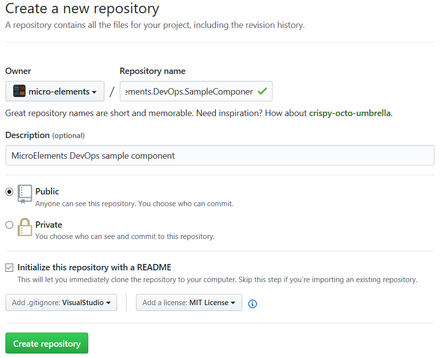
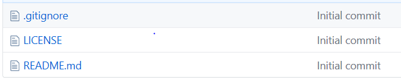
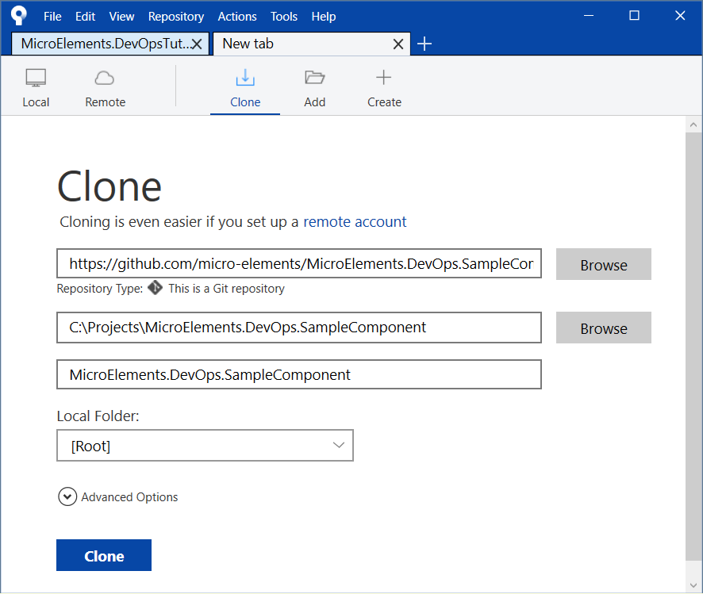
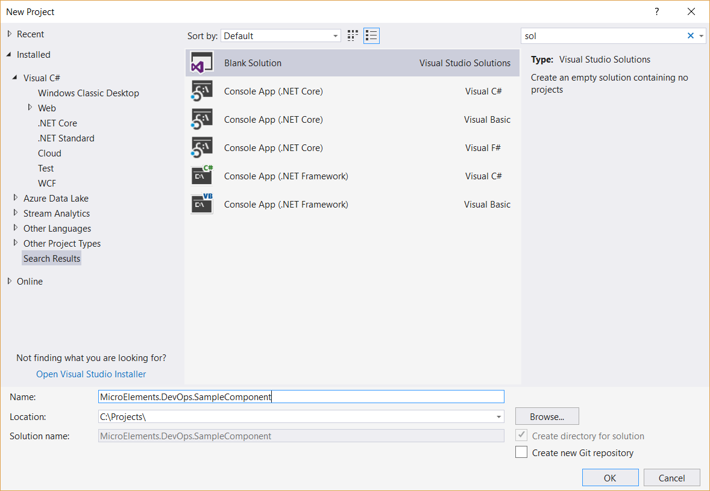
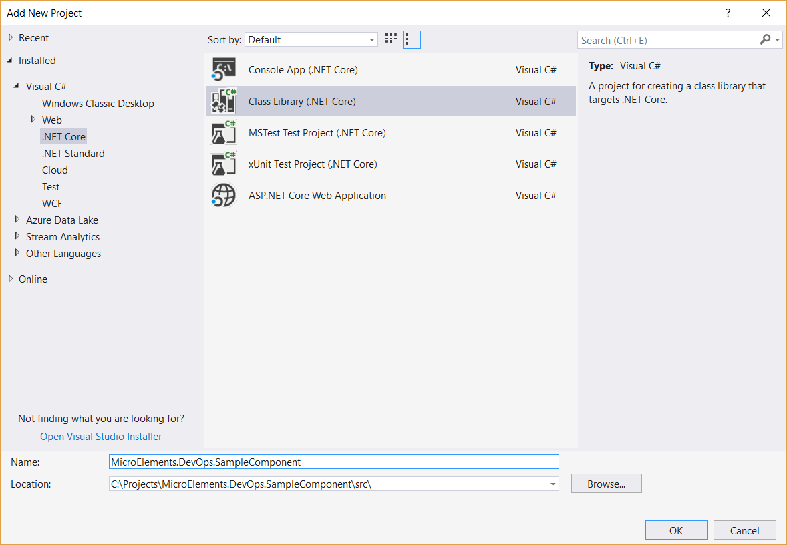
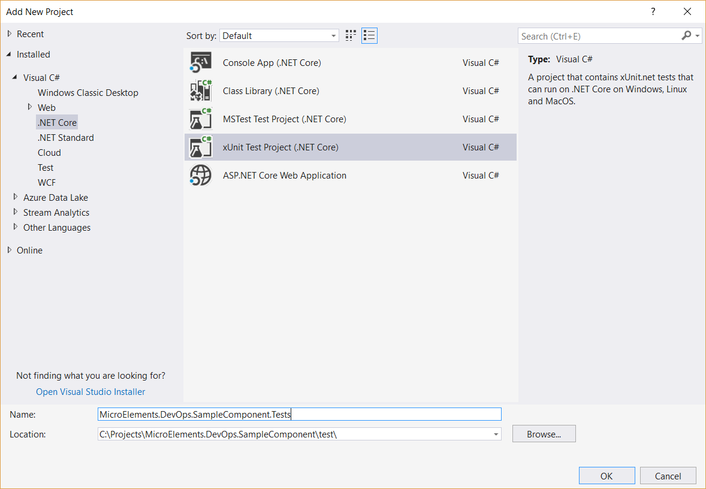

# Project Structure

## 1. Create new github repository


- Select name for project. For example: "MicroElement.DevOps.SampleComponent"
- Enter description: "MicroElements DevOps sample component"
- Check "Initialize this repository with a README"
- Select "Add .gitignore VisualStudio"
- Select "Add a license" for example MIT
- Press button "Create repository"



After you press "Create repository" github creates new repository with "Initial commit"

### Result


## 2. Clone repository
To create your own commits you need to clone repo to local computer. Select local folder "MicroElements.DevOps.SampleComponent"

## 2. Add folders
- Add folders: src, test

## 3. Create your projects
- Create blank solution in root folder named MicroElements.DevOps.SampleComponent.sln (name should be equal to repo name)
- Create your project in src folder (MicroElements.DevOps.SampleComponent)
- Create test project in test folder (MicroElements.DevOps.SampleComponent.Tests)

Repository structure

```
MicroElements.DevOps.SampleComponent
│   .gitignore
│   LICENSE
│   MicroElements.DevOps.SampleComponent.sln
│   README.md
└───src
│   └───MicroElements.DevOps.SampleComponent
│       │   MicroElements.DevOps.SampleComponent.csproj
│       │   Class1.cs
│       │   ...
│   
└───test
    └───MicroElements.DevOps.SampleComponent.Tests
│       │   MicroElements.DevOps.SampleComponent.csproj
│       │   UnitTest1.cs
```

## 4. Create you first commit
- commit all
- push to github

## Pictures
### Clone

### Create solution

### Add project

### Add test project

