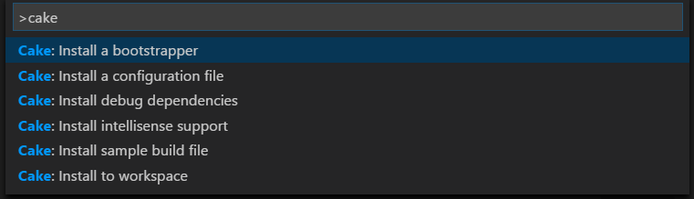

# Adding cake build

## Why
[CakeBuild](https://cakebuild.net/) is build script powered by Roslyn and c#.

Main benefits:
- Cross platform: works on Windows, Linix and MacOS
- Full power of c# language
- Many plugins for most you can imagine

## Result
Cake script that can: build project, run tests

## Prerequisites
- VS Code with plugins: C#, Cake
- Other editors: https://cakebuild.net/docs/editors/

## Steps
Press Ctrl+Shift+P

Run commands:
- Cake: Install a bootstrapper
- Cake: Install sample build file
- Cake: ...

### Change gitignore for cake
- Find section # Cake in .gitignore
- Uncomment line # tools/**

### Modify cake.build
- Add build task
- Add test task
- TODO add samples